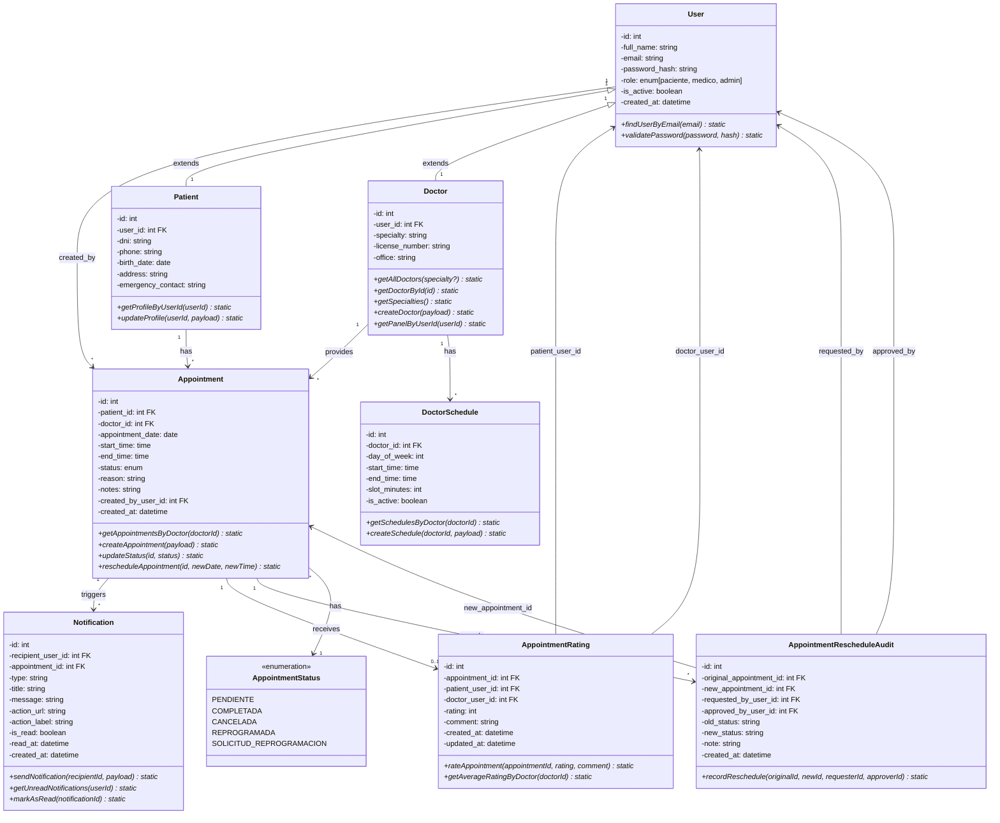
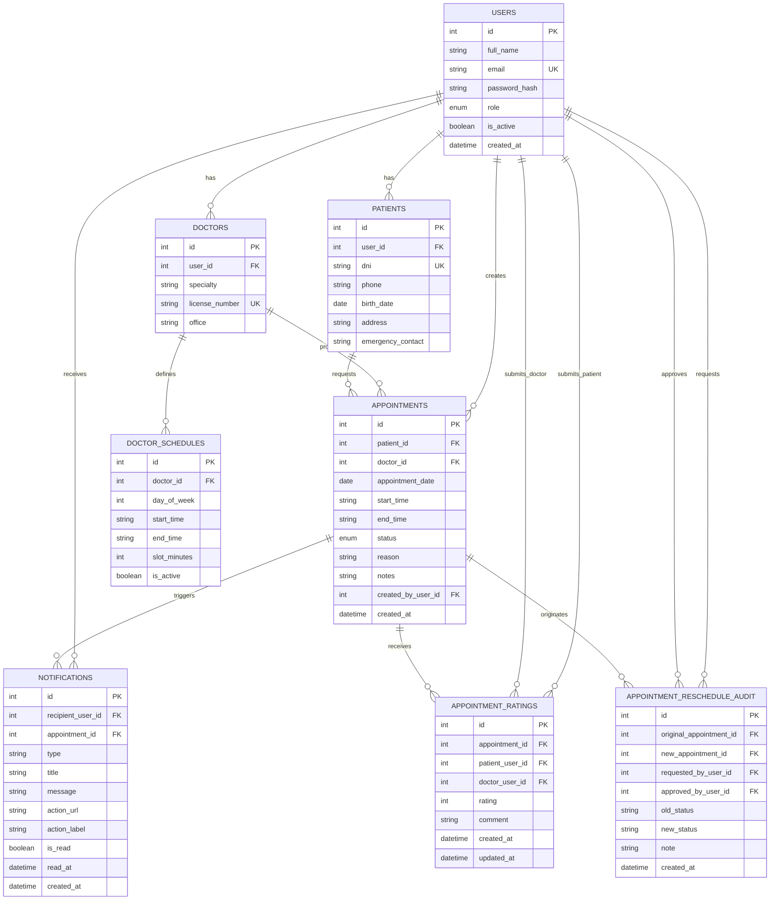

# 📊 DIAGRAMAS DEL SISTEMA - Sistema de Gestión de Citas Médicas

## 🏥 Policlínico San Juan Bautista

---

## 1️⃣ DIAGRAMA DE CLASES

Modelado orientado a objetos del sistema completo.



### 📝 Descripción de Clases

| Clase | Descripción |
|-------|-------------|
| **User** | Base de autenticación. Roles: paciente, médico, admin |
| **Patient** | Especialización con datos médicos (DNI, teléfono, emergencia) |
| **Doctor** | Especialización con datos profesionales (especialidad, colegiatura) |
| **DoctorSchedule** | Disponibilidad horaria semanal (día, hora inicio/fin, duración slot) |
| **Appointment** | Cita médica (núcleo del sistema) con 5 estados posibles |
| **AppointmentStatus** | Enum: pendiente, completada, cancelada, reprogramada, solicitud_reprogramacion |
| **AppointmentRating** | Calificación post-cita (1-5 estrellas) con comentarios |
| **Notification** | Alertas del sistema a usuarios |
| **AppointmentRescheduleAudit** | Auditoría de todos los cambios de citas |

---

## 2️⃣ MODELO LÓGICO DE BASE DE DATOS

Especificación de entidades, atributos y relaciones (agnóstico de DBMS).



### 📋 Especificación de Entidades

#### USERS
| Atributo | Tipo | Restricción | Descripción |
|----------|------|-------------|-------------|
| id | INTEGER | PK, AUTO | Identificador único |
| full_name | TEXT | NOT NULL | Nombre completo |
| email | TEXT | UNIQUE, NOT NULL | Email único |
| password_hash | TEXT | NOT NULL | Hash bcrypt |
| role | TEXT | CHECK(IN('paciente','medico','admin')) | Rol del usuario |
| is_active | INTEGER | DEFAULT 1 | Soft delete |
| created_at | TEXT | DEFAULT CURRENT_TIMESTAMP | Fecha de registro |

#### PATIENTS
| Atributo | Tipo | Restricción | Descripción |
|----------|------|-------------|-------------|
| id | INTEGER | PK, AUTO | Identificador |
| user_id | INTEGER | FK, UNIQUE, NOT NULL | Relación 1:1 con USERS |
| dni | TEXT | UNIQUE, NOT NULL | DNI único |
| phone | TEXT | NOT NULL | Teléfono |
| birth_date | TEXT | NULL | Fecha nacimiento ISO |
| address | TEXT | NULL | Dirección |
| emergency_contact | TEXT | NULL | Contacto emergencia |

#### DOCTORS
| Atributo | Tipo | Restricción | Descripción |
|----------|------|-------------|-------------|
| id | INTEGER | PK, AUTO | Identificador |
| user_id | INTEGER | FK, UNIQUE | Relación 1:1 con USERS |
| specialty | TEXT | NOT NULL | Especialidad médica |
| license_number | TEXT | UNIQUE, NOT NULL | Colegiatura |
| office | TEXT | NULL | Consultorio |

#### DOCTOR_SCHEDULES
| Atributo | Tipo | Restricción | Descripción |
|----------|------|-------------|-------------|
| id | INTEGER | PK, AUTO | Identificador |
| doctor_id | INTEGER | FK, NOT NULL | Referencia a DOCTORS |
| day_of_week | INTEGER | CHECK(0-6), NOT NULL | Día semana |
| start_time | TEXT | NOT NULL | Hora inicio (HH:MM) |
| end_time | TEXT | NOT NULL | Hora fin (HH:MM) |
| slot_minutes | INTEGER | DEFAULT 30 | Duración de slot |
| is_active | INTEGER | DEFAULT 1 | Programación activa |

#### APPOINTMENTS
| Atributo | Tipo | Restricción | Descripción |
|----------|------|-------------|-------------|
| id | INTEGER | PK, AUTO | Identificador |
| patient_id | INTEGER | FK, NOT NULL | Referencia a PATIENTS |
| doctor_id | INTEGER | FK, NOT NULL | Referencia a DOCTORS |
| appointment_date | TEXT | NOT NULL | Fecha ISO |
| start_time | TEXT | NOT NULL | Hora inicio |
| end_time | TEXT | NOT NULL | Hora fin |
| status | TEXT | CHECK(IN(...)), DEFAULT 'pendiente' | Estado |
| reason | TEXT | NULL | Motivo de consulta |
| notes | TEXT | NULL | Notas del médico |
| created_by_user_id | INTEGER | FK, NOT NULL | Usuario creador |
| created_at | TEXT | DEFAULT CURRENT_TIMESTAMP | Fecha creación |
| **Constraint** | UNIQUE(doctor_id, appointment_date, start_time) | No solapamiento |

#### APPOINTMENT_RATINGS
| Atributo | Tipo | Restricción | Descripción |
|----------|------|-------------|-------------|
| id | INTEGER | PK, AUTO | Identificador |
| appointment_id | INTEGER | FK, UNIQUE, NOT NULL | Cita a calificar |
| patient_user_id | INTEGER | FK, NOT NULL | Usuario paciente |
| doctor_user_id | INTEGER | FK, NOT NULL | Usuario médico |
| rating | INTEGER | CHECK(1-5), NOT NULL | Calificación 1-5 |
| comment | TEXT | NULL | Comentario |
| created_at | TEXT | DEFAULT CURRENT_TIMESTAMP | Creación |
| updated_at | TEXT | DEFAULT CURRENT_TIMESTAMP | Última edición |

#### NOTIFICATIONS
| Atributo | Tipo | Restricción | Descripción |
|----------|------|-------------|-------------|
| id | INTEGER | PK, AUTO | Identificador |
| recipient_user_id | INTEGER | FK, NOT NULL | Usuario receptor |
| appointment_id | INTEGER | FK, NULL | Cita relacionada |
| type | TEXT | DEFAULT 'info' | Tipo (info, warning, error) |
| title | TEXT | NOT NULL | Título |
| message | TEXT | NOT NULL | Cuerpo |
| action_url | TEXT | NULL | URL de acción |
| action_label | TEXT | NULL | Etiqueta botón |
| is_read | INTEGER | DEFAULT 0 | Leída |
| read_at | TEXT | NULL | Fecha de lectura |
| created_at | TEXT | DEFAULT CURRENT_TIMESTAMP | Creación |

#### APPOINTMENT_RESCHEDULE_AUDIT
| Atributo | Tipo | Restricción | Descripción |
|----------|------|-------------|-------------|
| id | INTEGER | PK, AUTO | Identificador |
| original_appointment_id | INTEGER | FK, NOT NULL | Cita original |
| new_appointment_id | INTEGER | FK, NULL | Nueva cita |
| requested_by_user_id | INTEGER | FK, NOT NULL | Quién solicitó |
| approved_by_user_id | INTEGER | FK, NOT NULL | Quién aprobó |
| old_status | TEXT | NOT NULL | Estado anterior |
| new_status | TEXT | NOT NULL | Estado nuevo |
| note | TEXT | NULL | Notas del cambio |
| created_at | TEXT | DEFAULT CURRENT_TIMESTAMP | Fecha cambio |

---

## 3️⃣ MODELO FÍSICO DE BASE DE DATOS

Implementación en SQLite3 con índices y optimizaciones.

### Scripts DDL

```sql
-- Tabla USERS
CREATE TABLE IF NOT EXISTS users (
  id INTEGER PRIMARY KEY AUTOINCREMENT,
  full_name TEXT NOT NULL,
  email TEXT NOT NULL UNIQUE,
  password_hash TEXT NOT NULL,
  role TEXT NOT NULL CHECK(role IN ('paciente', 'medico', 'admin')),
  is_active INTEGER NOT NULL DEFAULT 1,
  created_at TEXT NOT NULL DEFAULT (datetime('now'))
);
CREATE UNIQUE INDEX IF NOT EXISTS idx_users_email ON users(email);

-- Tabla PATIENTS
CREATE TABLE IF NOT EXISTS patients (
  id INTEGER PRIMARY KEY AUTOINCREMENT,
  user_id INTEGER NOT NULL UNIQUE,
  dni TEXT NOT NULL UNIQUE,
  phone TEXT NOT NULL,
  birth_date TEXT,
  address TEXT,
  emergency_contact TEXT,
  FOREIGN KEY(user_id) REFERENCES users(id) ON DELETE CASCADE
);
CREATE INDEX IF NOT EXISTS idx_patients_dni ON patients(dni);

-- Tabla DOCTORS
CREATE TABLE IF NOT EXISTS doctors (
  id INTEGER PRIMARY KEY AUTOINCREMENT,
  user_id INTEGER UNIQUE,
  specialty TEXT NOT NULL,
  license_number TEXT NOT NULL UNIQUE,
  office TEXT,
  FOREIGN KEY(user_id) REFERENCES users(id) ON DELETE SET NULL
);
CREATE INDEX IF NOT EXISTS idx_doctors_specialty ON doctors(specialty);

-- Tabla DOCTOR_SCHEDULES
CREATE TABLE IF NOT EXISTS doctor_schedules (
  id INTEGER PRIMARY KEY AUTOINCREMENT,
  doctor_id INTEGER NOT NULL,
  day_of_week INTEGER NOT NULL CHECK(day_of_week BETWEEN 0 AND 6),
  start_time TEXT NOT NULL,
  end_time TEXT NOT NULL,
  slot_minutes INTEGER NOT NULL DEFAULT 30,
  is_active INTEGER NOT NULL DEFAULT 1,
  FOREIGN KEY(doctor_id) REFERENCES doctors(id) ON DELETE CASCADE
);
CREATE INDEX IF NOT EXISTS idx_schedules_doctor_day 
  ON doctor_schedules(doctor_id, day_of_week, is_active);

-- Tabla APPOINTMENTS
CREATE TABLE IF NOT EXISTS appointments (
  id INTEGER PRIMARY KEY AUTOINCREMENT,
  patient_id INTEGER NOT NULL,
  doctor_id INTEGER NOT NULL,
  appointment_date TEXT NOT NULL,
  start_time TEXT NOT NULL,
  end_time TEXT NOT NULL,
  status TEXT NOT NULL DEFAULT 'pendiente' 
    CHECK(status IN ('pendiente', 'completada', 'cancelada', 'reprogramada', 'solicitud_reprogramacion')),
  reason TEXT,
  notes TEXT,
  created_by_user_id INTEGER NOT NULL,
  created_at TEXT NOT NULL DEFAULT (datetime('now')),
  FOREIGN KEY(patient_id) REFERENCES patients(id),
  FOREIGN KEY(doctor_id) REFERENCES doctors(id),
  FOREIGN KEY(created_by_user_id) REFERENCES users(id),
  UNIQUE(doctor_id, appointment_date, start_time)
);
CREATE INDEX IF NOT EXISTS idx_appointments_patient 
  ON appointments(patient_id, appointment_date DESC);
CREATE INDEX IF NOT EXISTS idx_appointments_doctor 
  ON appointments(doctor_id, appointment_date DESC, status);

-- Tabla APPOINTMENT_RATINGS
CREATE TABLE IF NOT EXISTS appointment_ratings (
  id INTEGER PRIMARY KEY AUTOINCREMENT,
  appointment_id INTEGER NOT NULL UNIQUE,
  patient_user_id INTEGER NOT NULL,
  doctor_user_id INTEGER NOT NULL,
  rating INTEGER NOT NULL CHECK(rating BETWEEN 1 AND 5),
  comment TEXT,
  created_at TEXT NOT NULL DEFAULT (datetime('now')),
  updated_at TEXT NOT NULL DEFAULT (datetime('now')),
  FOREIGN KEY(appointment_id) REFERENCES appointments(id) ON DELETE CASCADE,
  FOREIGN KEY(patient_user_id) REFERENCES users(id) ON DELETE CASCADE,
  FOREIGN KEY(doctor_user_id) REFERENCES users(id) ON DELETE CASCADE
);
CREATE INDEX IF NOT EXISTS idx_appointment_ratings_doctor 
  ON appointment_ratings(doctor_user_id, created_at DESC);

-- Tabla NOTIFICATIONS
CREATE TABLE IF NOT EXISTS notifications (
  id INTEGER PRIMARY KEY AUTOINCREMENT,
  recipient_user_id INTEGER NOT NULL,
  appointment_id INTEGER,
  type TEXT NOT NULL DEFAULT 'info',
  title TEXT NOT NULL,
  message TEXT NOT NULL,
  action_url TEXT,
  action_label TEXT,
  is_read INTEGER NOT NULL DEFAULT 0,
  read_at TEXT,
  created_at TEXT NOT NULL DEFAULT (datetime('now')),
  FOREIGN KEY(recipient_user_id) REFERENCES users(id) ON DELETE CASCADE,
  FOREIGN KEY(appointment_id) REFERENCES appointments(id) ON DELETE CASCADE
);
CREATE INDEX IF NOT EXISTS idx_notifications_recipient_read
  ON notifications(recipient_user_id, is_read, created_at DESC);

-- Tabla APPOINTMENT_RESCHEDULE_AUDIT
CREATE TABLE IF NOT EXISTS appointment_reschedule_audit (
  id INTEGER PRIMARY KEY AUTOINCREMENT,
  original_appointment_id INTEGER NOT NULL,
  new_appointment_id INTEGER,
  requested_by_user_id INTEGER NOT NULL,
  approved_by_user_id INTEGER NOT NULL,
  old_status TEXT NOT NULL,
  new_status TEXT NOT NULL,
  note TEXT,
  created_at TEXT NOT NULL DEFAULT (datetime('now')),
  FOREIGN KEY(original_appointment_id) REFERENCES appointments(id),
  FOREIGN KEY(new_appointment_id) REFERENCES appointments(id),
  FOREIGN KEY(requested_by_user_id) REFERENCES users(id),
  FOREIGN KEY(approved_by_user_id) REFERENCES users(id)
);
CREATE INDEX IF NOT EXISTS idx_audit_requested_by 
  ON appointment_reschedule_audit(requested_by_user_id, created_at DESC);
```

### 🔧 Optimizaciones SQLite

```sql
-- Configuración de rendimiento (en src/config/db.js)
PRAGMA journal_mode = WAL;           -- Write-Ahead Logging (concurrencia)
PRAGMA synchronous = NORMAL;         -- Balance rendimiento/seguridad
PRAGMA cache_size = -64000;          -- 64 MB de caché
PRAGMA foreign_keys = ON;            -- Validación de integridad
```

### 📊 Índices Implementados

| Tabla | Índice | Propósito |
|-------|--------|-----------|
| USERS | UNIQUE(email) | Login rápido |
| PATIENTS | UNIQUE(dni) | Búsqueda de paciente |
| DOCTORS | INDEX(specialty) | Filtro por especialidad |
| DOCTOR_SCHEDULES | INDEX(doctor_id, day_of_week, is_active) | Ver disponibilidad |
| APPOINTMENTS | UNIQUE(doctor_id, appointment_date, start_time) | No solapamiento |
| APPOINTMENTS | INDEX(patient_id, appointment_date DESC) | Citas del paciente |
| APPOINTMENTS | INDEX(doctor_id, appointment_date DESC, status) | Panel médico |
| NOTIFICATIONS | INDEX(recipient_id, is_read, created_at DESC) | Notificaciones no leídas |
| RATINGS | INDEX(doctor_user_id, created_at DESC) | Promedios por médico |

### 📈 Estimación de Tamaño

| Tabla | Registros est. | Tamaño est. |
|-------|---------------:|------------:|
| USERS | 100-1,000 | 0.1-0.5 MB |
| PATIENTS | 100-1,000 | 0.1-0.5 MB |
| DOCTORS | 10-100 | <0.1 MB |
| DOCTOR_SCHEDULES | 50-500 | <0.1 MB |
| APPOINTMENTS | 1,000-100,000 | 10-100 MB |
| NOTIFICATIONS | 10,000-1,000,000 | 50-200 MB |
| RATINGS | 100-10,000 | 1-10 MB |
| AUDIT | 100-10,000 | 1-10 MB |
| **Total** | | **~60-500 MB** |

---

## 🔗 Relaciones Clave

```
USERS (base de autenticación)
  ├─→ PATIENTS (1:1) → Datos de paciente
  ├─→ DOCTORS (1:1) → Datos de médico
  └─→ APPOINTMENTS (creador)

DOCTORS
  ├─→ DOCTOR_SCHEDULES (1:N) → Horarios
  └─→ APPOINTMENTS (1:N) → Citas que proporciona

PATIENTS
  └─→ APPOINTMENTS (1:N) → Citas que solicita

APPOINTMENTS (núcleo)
  ├─→ NOTIFICATIONS (1:N) → Alertas
  ├─→ APPOINTMENT_RATINGS (1:1) → Calificación
  └─→ APPOINTMENT_RESCHEDULE_AUDIT (1:N) → Auditoría
```

---

## ✅ Notas Técnicas

### Integridad Referencial
- **ON DELETE CASCADE**: PATIENTS, NOTIFICATIONS (si se elimina usuario/cita, se eliminan registros)
- **ON DELETE SET NULL**: DOCTORS.user_id (permite eliminar usuario sin eliminar registro médico)

### Estados de Cita
```
pendiente → Cita programada, sin atender
completada → Cita realizada
cancelada → Cita cancelada
reprogramada → Movida a otra fecha/hora
solicitud_reprogramacion → Cambio pendiente de aprobación
```

### Transacciones
Las operaciones críticas (crear cita, cambiar estado) usan transacciones para garantizar consistencia ACID.

### Seguridad
- Contraseñas: Hash bcrypt (nunca en plano)
- SQL Injection: Prepared statements (no concatenación)
- CSRF: Middleware de protección
- Sesiones: HttpOnly cookies

---

**Última actualización**: 2026-05-17
**Versión**: 1.0
**DBMS**: SQLite3 (better-sqlite3 v11.8.1)
**Estado**: Listo para producción
