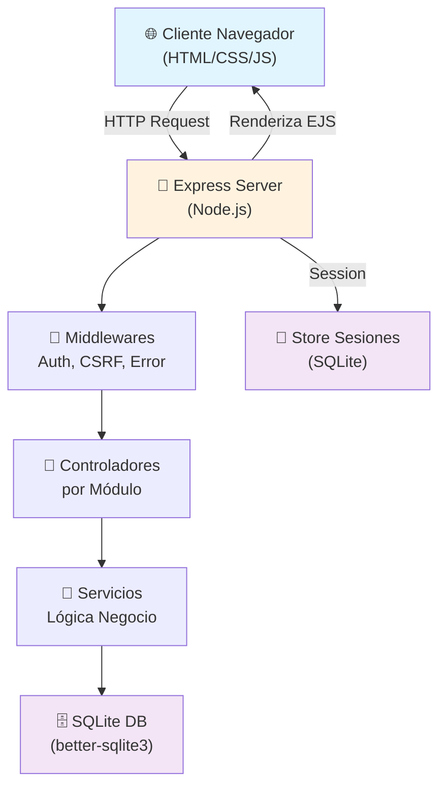
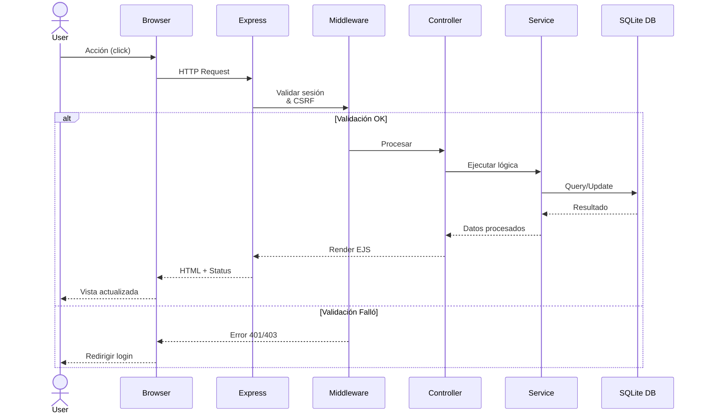
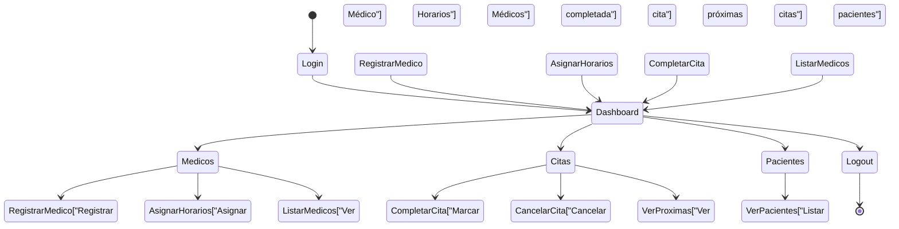
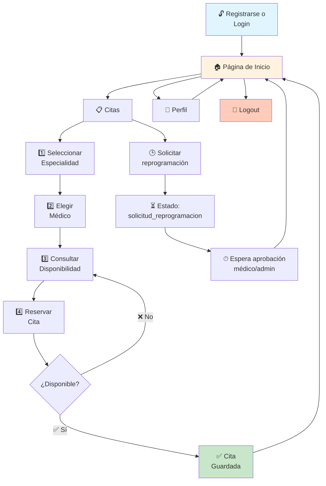
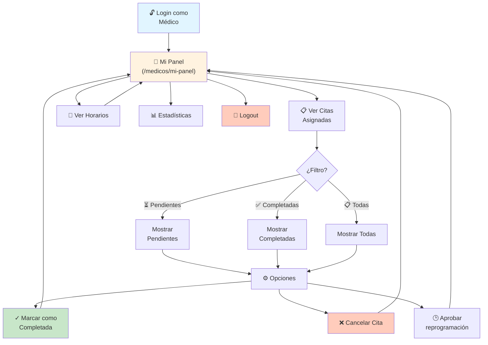

# 🏥 Sistema Web de Gestión de Citas
## Policlínico San Juan Bautista

<p align="center">
  <strong>Aplicación web full-stack para la gestión integral de citas médicas</strong><br>
  <em>Orientada a un flujo real de policlínico de atención ambulatoria</em>
</p>

---

## 📋 Tabla de contenidos

1. [Objetivo del Proyecto](#1-objetivo-del-proyecto)
2. [Stack Tecnológico](#2-stack-tecnológico)
3. [Diagrama de Arquitectura](#3-diagrama-de-arquitectura)
4. [Estructura del Proyecto](#4-estructura-del-proyecto)
5. [Requisitos](#5-requisitos)
6. [Guía de Instalación](#6-guía-de-instalación)
7. [Scripts Disponibles](#7-scripts-disponibles)
8. [Variables de Entorno](#8-variables-de-entorno)
9. [Credenciales de Acceso](#9-credenciales-de-acceso)
10. [Rutas principales por Módulo](#10-rutas-principales-por-módulo)
11. [Flujos de Uso por Rol](#11-flujos-de-uso-por-rol)
12. [Modelo de Datos](#12-modelo-de-datos)
13. [Funcionalidades Implementadas](#13-funcionalidades-implementadas)
14. [Seguridad](#14-seguridad)
15. [Solución de Problemas](#15-solución-de-problemas)
16. [Optimizaciones](#16-optimizaciones)
17. [Roadmap](#17-roadmap)

---

## 1. Objetivo del Proyecto

Este sistema digitaliza el proceso completo de gestión de citas médicas para tres tipos de usuarios:

| Rol | Descripción |
|-----|-------------|
| 🧑‍⚕️ **Médico** | Gestiona su disponibilidad horaria, revisa citas asignadas y marca pacientes atendidos |
| 👤 **Paciente** | Reserva citas con médicos disponibles según especialidad y horarios |
| 👨‍💼 **Administrador** | Supervisa todo el sistema: médicos, pacientes, citas y genera reportes |

**Características clave:**
- ✅ Registro y autenticación segura
- ✅ Gestión de horarios médicos por especialidad
- ✅ Reserva inteligente de citas con validación de disponibilidad
- ✅ Seguimiento del estado de atención
- ✅ Panel administrativo con métricas
- ✅ Control de acceso basado en roles (RBAC)

---

## 2. Stack Tecnológico

### **Backend**
- **Runtime:** Node.js (LTS 18+)
- **Framework:** Express.js (servidor HTTP y manejo de rutas)
- **Sesiones:** express-session + connect-sqlite3 (persistencia de estado)

### **Frontend**
- **Motor de vistas:** EJS (renderizado server-side)
- **Estilos:** CSS vanilla
- **JavaScript:** Vanilla JS (interactividad sin dependencias externas)

### **Base de Datos**
- **Motor:** SQLite (better-sqlite3)
- **Modo:** WAL para mejor concurrencia
- **Características:** Transacciones ACID, mejor manejo de escrituras concurrentes

### **Seguridad**
- 🔐 **helmet:** Headers de seguridad HTTP
- 🔐 **csurf:** Protección CSRF en formularios
- 🔐 **bcrypt:** Hash seguro de contraseñas
- 🔐 **express-rate-limit:** Limitación de intentos de login
- 🔐 **express-validator:** Validación de entrada en server

### **Logging y Monitoreo**
- **morgan:** Logs de HTTP en desarrollo
- **Logger personalizado:** Trazabilidad de eventos importantes

---

## 3. Diagrama de Arquitectura

### 3.1 Arquitectura de Capas

**Tipo de gráfico:** `Diagrama de flujo` (`graph TD`)



### 3.2 Flujo de una Solicitud HTTP

**Tipo de gráfico:** `Diagrama de secuencia` (`sequenceDiagram`)



### 3.3 Arquitectura de Módulos

**Tipo de gráfico:** `Diagrama de flujo` (`graph LR`)

```mermaid
graph LR
    subgraph Core["🔧 Core"]
        ENV["Config<br/>Env.js"]
        DB["Database<br/>db.js"]
        SESSION["Session<br/>session.js"]
    end
    
    subgraph Middleware["🔐 Middleware"]
        AUTH["auth.middleware"]
        CSRF["csrf.middleware"]
        ERROR["error.middleware"]
        ROLE["role.middleware"]
    end
    
    subgraph Modules["📦 Módulos"]
        AUTH_MOD["<b>Auth</b><br/>login/register"]
        CITAS["<b>Citas</b><br/>reservar/completar"]
        MEDICOS["<b>Médicos</b><br/>horarios/panel"]
        PACIENTES["<b>Pacientes</b><br/>perfil"]
        ADMIN["<b>Admin</b><br/>dashboard"]
    end
    
    Core -.-> Middleware
    Middleware --> Modules
    
    style Core fill:#f0f0f0
    style Modules fill:#fff9c4
```



---

## 4. Estructura del Proyecto

```
CIS_II/
├─ 📄 package.json                 # Dependencias y scripts
├─ 📄 README.md                    # Este archivo
├─ 📁 src/
│  ├─ app.js                       # Configuración Express (rutas, middleware)
│  ├─ server.js                    # Punto de entrada del servidor
│  │
│  ├─ 📁 config/                   # 🔧 Configuración centralizada
│  │  ├─ env.js                    # Variables de entorno
│  │  ├─ db.js                     # Conexión SQLite
│  │  └─ session.js                # Configuración sesiones
│  │
│  ├─ 📁 database/                 # 🗄️ Base de datos
│  │  ├─ schema.sql                # Definición de tablas
│  │  ├─ seed.sql                  # Datos de referencia iniciales
│  │  ├─ init-db.js                # Script de inicialización
│  │  └─ clinic.sqlite             # Archivo BD (generado)
│  │
│  ├─ 📁 middlewares/              # 🔐 Middleware personalizado
│  │  ├─ auth.middleware.js        # Valida sesión autenticada
│  │  ├─ role.middleware.js        # Control acceso por rol (RBAC)
│  │  ├─ csrf.middleware.js        # Protección CSRF
│  │  └─ error.middleware.js       # Manejo centralizado de errores
│  │
│  ├─ 📁 modules/                  # 📦 Módulos funcionales (MVC)
│  │  ├─ 📁 auth/
│  │  │  ├─ auth.controller.js     # Lógica login/registro
│  │  │  ├─ auth.routes.js         # Rutas GET/POST
│  │  │  ├─ auth.service.js        # Interacción con BD
│  │  │  └─ auth.validators.js     # Validación input
│  │  │
│  │  ├─ 📁 citas/
│  │  │  ├─ citas.controller.js    # Gestión citas (reservar/completar)
│  │  │  ├─ citas.routes.js
│  │  │  ├─ citas.service.js
│  │  │  └─ citas.validators.js
│  │  │
│  │  ├─ 📁 medicos/
│  │  │  ├─ medicos.controller.js  # Panel médico + gestión horarios
│  │  │  ├─ medicos.routes.js
│  │  │  ├─ medicos.service.js
│  │  │  └─ medicos.validators.js
│  │  │
│  │  ├─ 📁 pacientes/
│  │  │  ├─ pacientes.controller.js# Perfil paciente
│  │  │  ├─ pacientes.routes.js
│  │  │  ├─ pacientes.service.js
│  │  │  └─ pacientes.validators.js
│  │  │
│  │  └─ 📁 admin/
│  │     ├─ admin.controller.js    # Panel admin + métricas
│  │     ├─ admin.routes.js
│  │     └─ admin.service.js
│  │
│  ├─ 📁 public/                   # 🎨 Archivos estáticos
│  │  ├─ 📁 css/
│  │  │  └─ styles.css             # Estilos principales
│  │  ├─ 📁 img/                   # Imágenes
│  │  └─ 📁 js/
│  │     └─ main.js                # JS del cliente
│  │
│  ├─ 📁 utils/                    # 🛠️ Utilidades compartidas
│  │  ├─ constants.js              # Constantes (roles, estados, etc.)
│  │  ├─ date.js                   # Funciones manejo de fechas
│  │  └─ logger.js                 # Logger personalizado
│  │
│  └─ 📁 views/                    # 📄 Templates EJS
│     ├─ 📁 auth/
│     │  ├─ login.ejs
│     │  └─ register.ejs
│     ├─ 📁 citas/
│     │  └─ index.ejs
│     ├─ 📁 medicos/
│     │  ├─ index.ejs
│     │  ├─ doctor-panel.ejs
│     │  └─ schedules.ejs
│     ├─ 📁 pacientes/
│     │  └─ profile.ejs
│     ├─ 📁 admin/
│     │  └─ dashboard.ejs
│     ├─ 📁 layouts/
│     │  └─ error.ejs
│     └─ 📁 partials/              # Componentes reutilizables
│        ├─ head.ejs
│        ├─ nav.ejs
│        ├─ foot.ejs
│        └─ flash.ejs
│
└─ 📁 tests/                       # 🧪 Base de pruebas (placeholders)
   ├─ auth.test.js
   ├─ citas.test.js
   └─ pacientes.test.js
```

**Patrón de organización:**
- Cada módulo funcional sigue la estructura **MVC** (Model-View-Controller)
- `*-controller.js`: Maneja solicitudes HTTP
- `*-service.js`: Contiene lógica de negocio
- `*-routes.js`: Define endpoints
- `*-validators.js`: Valida datos de entrada

---

## 5. Requisitos

| Componente | Versión | Descripción |
|-----------|---------|-------------|
| **Node.js** | 18.0.0+ | Runtime de JavaScript |
| **npm** | 9.0.0+ | Gestor de paquetes |
| **SQLite3** | 3.36.0+ | Motor de base de datos (incluido en better-sqlite3) |
| **git** | *opcional* | Control de versiones |

**Verificación rápida:**

```bash
# Comprobar versiones instaladas
node -v    # Debería mostrar v18.x.x o superior
npm -v     # Debería mostrar 9.x.x o superior
```

---

## 6. Guía de Instalación

### 6.1 Inicio Rápido (3 pasos)

Ejecute estos comandos desde la raíz del proyecto (`CIS_II`):

```bash
# 1️⃣ Instalar todas las dependencias
npm install

# 2️⃣ Inicializar base de datos (crea tablas + datos de prueba)
npm run db:init

# 3️⃣ Iniciar servidor
npm start
```

Luego abra en su navegador:
```
http://localhost:3000
```

### 6.2 Pasos Detallados

#### Paso 1: Instalar Dependencias

```bash
npm install
```

*Esto lee `package.json` e instala todos los paquetes en `node_modules/`*

#### Paso 2: Inicializar Base de Datos

```bash
npm run db:init
```

**¿Qué ocurre?**
- ✅ Crea archivo `src/database/clinic.sqlite`
- ✅ Ejecuta `schema.sql` (crea tablas)
- ✅ Ejecuta `init-db.js` (siembra datos de referencia desde arreglos internos)
- ✅ Genera usuarios admin, médicos y pacientes de demo
- ✅ Carga citas de ejemplo

**Datos creados:**
- 1 administrador
- 11 médicos (con especialidades)
- 11 pacientes
- 20+ citas de ejemplo

#### Paso 3: Iniciar Servidor

```bash
npm start
```

**Salida esperada:**
```
Base de datos inicializada y datos de referencia cargados.
Admin: admin@policlinico.pe / Admin123*
Medicos y pacientes demo usan la contrasena: Admin123*
Servidor iniciado en http://localhost:3000
```

Presione `Ctrl + C` para detener el servidor.

### 6.3 Desarrollo con Reinicio Automático

Durante desarrollo, use modo watch para reiniciar automáticamente:

```bash
npm run dev
```

*Detecta cambios en archivos y reinicia el servidor automáticamente*

### 6.4 Reinicio Limpio de la Base de Datos

Si necesita comenzar con datos frescos:

```bash
# Detener servidor (Ctrl + C si está corriendo)

# Opción 1: Eliminar archivo y reinicializar
rm src/database/clinic.sqlite
npm run db:init

# Opción 2: En PowerShell (Windows)
Remove-Item src/database/clinic.sqlite -Force
npm run db:init
```

### 6.5 Abrir la Base de Datos en VS Code (SQLite Viewer)

Para explorar la base de datos sin salir de VS Code:

1. Instale la extensión **SQLite Viewer**
    - Marketplace ID: `qwtel.sqlite-viewer`
2. Abra el archivo principal de base de datos:
    - `src/database/clinic.sqlite`
3. Haga clic derecho sobre el archivo y seleccione **Open Database**.
4. Explore tablas y ejecute consultas en modo lectura.

Si el archivo `src/database/clinic.sqlite` no existe todavía:

```bash
npm run db:init
```

**Nota:**
- `clinic.sqlite-wal` y `clinic.sqlite-shm` son archivos auxiliares del modo WAL.
- El archivo principal que debe abrir es `clinic.sqlite`.

---

## 7. Scripts Disponibles

Definidos en `package.json`, ejecútelos con `npm run <nombre>`:

| Script | Comando | Descripción |
|--------|---------|-------------|
| `start` | `node src/server.js` | Inicia servidor en producción |
| `dev` | `node --watch src/server.js` | Modo desarrollo con reinicio automático |
| `db:init` | `node src/database/init-db.js` | Inicializa/reinicia base de datos |

**Ejemplos de uso:**
```bash
npm start          # Servidor normal
npm run dev        # Con watch (desarrollo)
npm run db:init    # Reinicializar BD
```

---

## 8. Variables de Entorno

Configuradas principalmente en [`src/config/env.js`](src/config/env.js). Se cargan del archivo `.env` (si existe) o usan valores por defecto.

### 8.1 Referencias Principales

| Variable | Por Defecto | Descripción |
|----------|-----------|-------------|
| `PORT` | `3000` | Puerto HTTP donde escucha el servidor |
| `NODE_ENV` | `development` | Entorno (`development` \| `production`) |
| `SESSION_SECRET` | `change_me_please` | ⚠️ Secreto para firmar sesiones (cambiar en producción) |
| `DB_PATH` | `./src/database/clinic.sqlite` | Ruta archivo SQLite |

### 8.2 Configuración Recomendada para Desarrollo

Crear archivo `.env` en la raíz del proyecto:

```env
# .env (NUNCA subir a git)
PORT=3000
NODE_ENV=development
SESSION_SECRET=secreto_desarrollo_temporal_cambiar_en_prod
DB_PATH=./src/database/clinic.sqlite
LOG_LEVEL=debug
```

### 8.3 Configuración para Producción

```env
PORT=443
NODE_ENV=production
SESSION_SECRET=coloca_aqui_un_secreto_largo_criptografico_unico_muy_seguro_min_32_caracteres
DB_PATH=/var/lib/clinic/clinic.sqlite
LOG_LEVEL=info
```

⚠️ **En producción:**
- Usar `SESSION_SECRET` largo y aleatorio (mínimo 32 caracteres)
- Forzar HTTPS
- Usar cookies seguras (`secure=true`, `sameSite=strict`)
- Guardar `.env` como secreto en producción (no en git)

---

## 9. Credenciales de Acceso

La inicialización (`npm run db:init`) crea automáticamente usuarios de demo listos para pruebas.

**Contraseña por defecto para TODOS los usuarios demo:** `Admin123*`

### 9.1 Administrador

Acceso completo al sistema, gestión de médicos y pacientes, métricas.

| Email | Contraseña | Rol |
|-------|-----------|-----|
| `admin@policlinico.pe` | `Admin123*` | 👨‍💼 Administrador |

**Acceso:** [`http://localhost:3000/auth/login`](http://localhost:3000/auth/login)

### 9.2 Médicos (11 Especialidades)

Cada médico puede revisar sus citas y actualizar su disponibilidad.

| Email | Contraseña | Especialidad |
|-------|-----------|--------------|
| `ana.torres@policlinico.pe` | `Admin123*` | 🩺 Medicina General |
| `carlos.rios@policlinico.pe` | `Admin123*` | ❤️ Cardiología |
| `lucia.herrera@policlinico.pe` | `Admin123*` | 👧 Pediatría |
| `mateo.salazar@policlinico.pe` | `Admin123*` | 🔴 Dermatología |
| `valeria.nunez@policlinico.pe` | `Admin123*` | 🧠 Neurología |
| `diego.paredes@policlinico.pe` | `Admin123*` | 🦴 Traumatología |
| `sofia.campos@policlinico.pe` | `Admin123*` | 👶 Ginecología |
| `renato.flores@policlinico.pe` | `Admin123*` | 🧬 Endocrinología |
| `patricia.leon@policlinico.pe` | `Admin123*` | 👂 Otorrinolaringología |
| `javier.molina@policlinico.pe` | `Admin123*` | 💧 Urología |
| `elisa.romero@policlinico.pe` | `Admin123*` | 👁️ Oftalmología |

### 9.3 Pacientes (11 Usuarios)

Pueden reservar citas con médicos según disponibilidad.

| Email | Contraseña | 
|-------|-----------|
| `maria.perez@pacientes.pe` | `Admin123*` |
| `jose.quispe@pacientes.pe` | `Admin123*` |
| `carla.mendoza@pacientes.pe` | `Admin123*` |
| `luis.alvarado@pacientes.pe` | `Admin123*` |
| `rosa.huaman@pacientes.pe` | `Admin123*` |
| `andrea.salinas@pacientes.pe` | `Admin123*` |
| `pedro.caceres@pacientes.pe` | `Admin123*` |
| `daniela.rojas@pacientes.pe` | `Admin123*` |
| `ricardo.vega@pacientes.pe` | `Admin123*` |
| `luciana.soto@pacientes.pe` | `Admin123*` |
| `fernando.aquino@pacientes.pe` | `Admin123*` |

### 9.4 Citas de Ejemplo

Se incluyen citas de prueba en diferentes estados:
- ✅ **Completadas:** Para simular historial
- ⏳ **Pendientes:** Para probar flujo de atención
- ❌ **Canceladas:** Para validar cancelaciones

---

## 10. Rutas principales por Módulo

### 10.1 🔐 Módulo Auth (Autenticación)

Maneja registro, login y logout de usuarios.

| Método | Ruta | Descripción | Acceso |
|--------|------|------------|--------|
| GET | `/auth/login` | Formulario de login | Público |
| POST | `/auth/login` | Procesar login | Público |
| GET | `/auth/register` | Formulario de registro | Público |
| POST | `/auth/register` | Procesar nuevo usuario | Público |
| POST | `/auth/logout` | Cerrar sesión | Autenticado |

**Archivo:** [`src/modules/auth/auth.routes.js`](src/modules/auth/auth.routes.js)

---

### 10.2 📋 Módulo Citas (Gestión de Citas)

Reserva, consulta disponibilidad y marca de completitud de citas.

| Método | Ruta | Descripción | Acceso | Detalles |
|--------|------|------------|--------|---------|
| GET | `/citas` | Listar citas del usuario | Autenticado | Filtra por rol (paciente/médico/admin) |
| GET | `/citas/disponibilidad` | Disponibilidad por médico/fecha | Paciente/Admin | Datos JSON para AJAX |
| POST | `/citas` | Crear nueva cita | Paciente | Valida disponibilidad |
| POST | `/citas/:id/completar` | Marcar cita completada | Admin/Médico | Cambia estado a "completada" |
| POST | `/citas/:id/cancelar` | Cancelar cita | Admin/Médico/Paciente | Depende del estado |
| POST | `/citas/:id/solicitar-reprogramacion` | Solicitar reprogramación | Paciente | Cambia estado a "solicitud_reprogramacion" |
| POST | `/citas/:id/aprobar-reprogramacion` | Aprobar reprogramación | Admin/Médico | Marca original como "reprogramada" y crea una nueva cita "pendiente" automática |

**Características:**
- ✅ Filtro dinámico por especialidad
- ✅ Lista de médicos actualiza según especialidad
- ✅ Validación de horarios disponibles
- ✅ Prevención de doble reserva

#### Flujo de reprogramación (nuevo)

- El **paciente** solicita la reprogramación de una cita pendiente.
- El sistema cambia la cita a estado `solicitud_reprogramacion`.
- Un **médico** (de esa cita) o **administrador** revisa y aprueba.
- Al aprobar, la cita original pasa a estado `reprogramada`.
- El sistema genera una **nueva cita automática** en el siguiente horario disponible del mismo médico.
- Se registra trazabilidad en la tabla `appointment_reschedule_audit` (quién solicitó, quién aprobó, y detalle del cambio).

**Archivo:** [`src/modules/citas/citas.routes.js`](src/modules/citas/citas.routes.js)

---

### 10.3 👨‍⚕️ Módulo Médicos (Médicos y Horarios)

Gestión de perfiles médicos, especialidades y horarios de atención.

| Método | Ruta | Descripción | Acceso |
|--------|------|------------|--------|
| GET | `/medicos` | Listar médicos | Admin |
| POST | `/medicos` | Registrar nuevo médico | Admin |
| GET | `/medicos/mi-panel` | Panel personal del médico | Médico |
| GET | `/medicos/:doctorId/horarios` | Ver horarios de médico | Admin |
| POST | `/medicos/:doctorId/horarios` | Crear/actualizar horarios | Admin |

**En Panel de Médico (/medicos/mi-panel):**
- 📅 Ver citas asignadas
- ⏰ Revisar horarios
- 📊 Estadísticas personales

**Archivo:** [`src/modules/medicos/medicos.routes.js`](src/modules/medicos/medicos.routes.js)

---

### 10.4 👤 Módulo Pacientes (Perfil Paciente)

Gestión de información personal del paciente.

| Método | Ruta | Descripción | Acceso |
|--------|------|------------|--------|
| GET | `/pacientes/perfil` | Ver perfil | Paciente |
| POST | `/pacientes/perfil` | Actualizar datos | Paciente |

**Información disponible:**
- 📋 Datos personales
- 📞 Contacto
- 📋 Historial de citas

**Archivo:** [`src/modules/pacientes/pacientes.routes.js`](src/modules/pacientes/pacientes.routes.js)

---

### 10.5 🎯 Módulo Admin (Administración)

Panel administrativo con métricas generales del sistema.

| Método | Ruta | Descripción | Acceso |
|--------|------|------------|--------|
| GET | `/admin` | Dashboard con métricas | Admin |

**En Dashboard Admin (/admin):**
- 📊 Total de citas (por estado)
- 👥 Total de médicos y pacientes
- 📈 Próximas citas a atender
- 🔍 Búsqueda rápida

**Archivo:** [`src/modules/admin/admin.routes.js`](src/modules/admin/admin.routes.js)

---

## 11. Flujos de Uso por Rol

Cada rol tiene un flujo específico optimizado para su función.

### 11.1 👨‍💼 Administrador

**Objetivo:** Supervisar todo el sistema y gestionar recursos.

**Tipo de gráfico:** `Diagrama de estados` (`stateDiagram-v2`)



**Pasos en el sistema:**

1. ✅ Inicia sesión con `admin@policlinico.pe`
2. 📊 Ve el **Dashboard** con métricas generales
3. 👨‍⚕️ Va a **Médicos**:
   - Registra especialistas
   - Asigna horarios de atención
   - Filtra por especialidad
4. 📋 Va a **Citas**:
   - Monitorea estado (pendiente/completada/cancelada)
   - Marca citas como completadas
   - Cancela citas si es necesario
5. 👥 Revisa **Pacientes** registrados

---

### 11.2 👤 Paciente

**Objetivo:** Reservar citas con médicos disponibles.

**Tipo de gráfico:** `Diagrama de flujo` (`graph TD`)



**Pasos en el sistema:**

1. ✅ Registrarse o usar credenciales demo
2. 📋 Ir a **Citas**
3. 🏥 Seleccionar **especialidad** (Cardiología, Pediatría, etc.)
4. 👨‍⚕️ Elegir **médico** de la lista
5. 📅 Consultar **disponibilidad** por fecha y hora
6. ✍️ **Confirmar reserva**
7. 📧 Recibe confirmación de cita
8. 👤 Puede ver su perfil y **historial de citas**

---

### 11.3 👨‍⚕️ Médico

**Objetivo:** Revisar citas asignadas y mantener su disponibilidad.

**Tipo de gráfico:** `Diagrama de flujo` (`graph TD`)



**Pasos en el sistema:**

1. ✅ Inicia sesión con sus credenciales
2. 🏥 Accede a **Mi Panel** (`/medicos/mi-panel`)
3. 👥 Revisa **citas asignadas** (filtradas por estado)
4. ⏰ Consulta sus **horarios** de atención
5. ✓ **Marca citas como completadas** cuando atiende
6. ❌ Puede **cancelar** si es necesario
7. 📊 Ve **estadísticas** personales

---

## 12. Modelo de Datos

La base de datos SQLite se organiza en tablas normalizadas para usuarios, perfiles (médico/paciente), horarios, citas, sesiones y auditoría de reprogramaciones.

### 12.1 Diagrama Entidad-Relación (ER)

**Tipo de gráfico:** `Diagrama entidad-relación` (`erDiagram`)

```mermaid
erDiagram
    USERS ||--|| PATIENTS : perfil
    USERS ||--o| DOCTORS : perfil
    DOCTORS ||--o{ DOCTOR_SCHEDULES : define
    PATIENTS ||--o{ APPOINTMENTS : reserva
    DOCTORS ||--o{ APPOINTMENTS : atiende
    USERS ||--o{ APPOINTMENTS : crea
    USERS ||--o{ SESSIONS : tiene
    APPOINTMENTS ||--o{ APPOINTMENT_RESCHEDULE_AUDIT : historial
    USERS ||--o{ APPOINTMENT_RESCHEDULE_AUDIT : solicita_aprueba

    USERS {
        int id PK
        string full_name
        string email UK
        string password_hash
        enum role "paciente|medico|admin"
        boolean is_active
        datetime created_at
    }

    PATIENTS {
        int id PK
        int user_id UK_FK
        string dni UK
        string phone
        date birth_date
        string address
        string emergency_contact
    }

    DOCTORS {
        int id PK
        int user_id UK_FK
        string specialty
        string license_number UK
        string office
    }

    DOCTOR_SCHEDULES {
        int id PK
        int doctor_id FK
        int day_of_week
        time start_time
        time end_time
        int slot_minutes
        boolean is_active
    }

    APPOINTMENTS {
        int id PK
        int patient_id FK
        int doctor_id FK
        date appointment_date
        time start_time
        time end_time
        enum status "pendiente|completada|cancelada|solicitud_reprogramacion|reprogramada"
        text reason
        text notes
        int created_by_user_id FK
        datetime created_at
    }

    SESSIONS {
        string sid PK
        text sess
        datetime expire
    }

    APPOINTMENT_RESCHEDULE_AUDIT {
        int id PK
        int original_appointment_id FK
        int new_appointment_id FK
        int requested_by_user_id FK
        int approved_by_user_id FK
        string old_status
        string new_status
        text note
        datetime created_at
    }
```

### 12.2 Descripción de Tablas

#### **USUARIOS**
Almacena todos los usuarios del sistema (pacientes, médicos, administrador).

| Campo | Tipo | Descripción |
|-------|------|-------------|
| `id` | INTEGER | Clave primaria (autoincremento) |
| `full_name` | TEXT | Nombre completo del usuario |
| `email` | TEXT | Email único, usado para login |
| `password_hash` | TEXT | Contraseña hasheada con bcrypt |
| `role` | TEXT | `'paciente'` \| `'medico'` \| `'admin'` |
| `is_active` | INTEGER | Estado del usuario (1 activo, 0 inactivo) |
| `created_at` | DATETIME | Marca de inserción |

---

#### **PATIENTS**
Datos clínicos y de contacto de los usuarios con rol paciente.

| Campo | Tipo | Descripción |
|-------|------|-------------|
| `id` | INTEGER | Clave primaria |
| `user_id` | INTEGER | Referencia única a `users.id` |
| `dni` | TEXT | Documento nacional (único) |
| `phone` | TEXT | Teléfono de contacto |
| `birth_date` | TEXT | Fecha de nacimiento |
| `address` | TEXT | Dirección |
| `emergency_contact` | TEXT | Contacto de emergencia |

---

#### **DOCTORS**
Datos profesionales de los usuarios con rol médico.

| Campo | Tipo | Descripción |
|-------|------|-------------|
| `id` | INTEGER | Clave primaria |
| `user_id` | INTEGER | Referencia única a `users.id` |
| `specialty` | TEXT | Especialidad médica |
| `license_number` | TEXT | Número de colegiatura/licencia (único) |
| `office` | TEXT | Consultorio |

---

#### **DOCTOR_SCHEDULES**
Disponibilidad semanal de cada médico.

| Campo | Tipo | Descripción |
|-------|------|-------------|
| `id` | INTEGER | Clave primaria |
| `doctor_id` | INTEGER | Referencia al médico |
| `day_of_week` | INTEGER | Día de semana (`0` domingo ... `6` sábado) |
| `start_time` | TEXT | Hora de inicio |
| `end_time` | TEXT | Hora de fin |
| `slot_minutes` | INTEGER | Duración de bloque de atención |
| `is_active` | INTEGER | Horario activo/inactivo |

---

#### **CITAS**
Registra todas las citas reservadas entre pacientes y médicos.

| Campo | Tipo | Descripción |
|-------|------|-------------|
| `id` | INTEGER | Clave primaria |
| `patient_id` | INTEGER | Referencia a `patients.id` |
| `doctor_id` | INTEGER | Referencia a `doctors.id` |
| `appointment_date` | TEXT | Fecha de la cita (`YYYY-MM-DD`) |
| `start_time` | TEXT | Hora de inicio |
| `end_time` | TEXT | Hora de fin |
| `status` | TEXT | `'pendiente'` \| `'completada'` \| `'cancelada'` \| `'solicitud_reprogramacion'` \| `'reprogramada'` |
| `reason` | TEXT | Motivo de consulta |
| `notes` | TEXT | Observaciones (opcional) |
| `created_by_user_id` | INTEGER | Usuario que creó la cita |
| `created_at` | DATETIME | Fecha de reserva |

---

#### **SESIONES**
Almacena sesiones activas (express-session con store SQLite).

| Campo | Tipo | Descripción |
|-------|------|-------------|
| `sid` | TEXT | ID de sesión (único) |
| `sess` | TEXT | Datos de sesión (JSON) |
| `expire` | DATETIME | Expiración de la sesión |

---

#### **APPOINTMENT_RESCHEDULE_AUDIT**
Almacena trazabilidad de reprogramaciones aprobadas.

| Campo | Tipo | Descripción |
|-------|------|-------------|
| `id` | INTEGER | Clave primaria |
| `original_appointment_id` | INTEGER | Cita original que fue reprogramada |
| `new_appointment_id` | INTEGER | Nueva cita creada automáticamente |
| `requested_by_user_id` | INTEGER | Usuario paciente que solicitó |
| `approved_by_user_id` | INTEGER | Usuario médico/admin que aprobó |
| `old_status` | TEXT | Estado anterior (`solicitud_reprogramacion`) |
| `new_status` | TEXT | Estado final de la cita original (`reprogramada`) |
| `note` | TEXT | Detalle de fecha/hora asignada automáticamente |
| `created_at` | DATETIME | Fecha de auditoría |

---

### 12.3 Relaciones Principales

```
Usuario (Médico)
    ↓ registra
Horarios 
    ↓ utiliza
Citas 
    ↓ requiere
Usuario (Paciente)
```

**Flujo de creación de cita:**
1. Médico registra sus horarios disponibles
2. Paciente consulta disponibilidad
3. Sistema busca horarios `disponible=true` del médico
4. Se crea registro en CITAS con `estado='pendiente'`
5. Se marca horario como `disponible=false`
6. Paciente puede solicitar reprogramación (`solicitud_reprogramacion`)
7. Médico/Admin aprueba: cita original pasa a `reprogramada` y se crea una nueva `pendiente`
8. Se registra auditoría en `appointment_reschedule_audit`
9. Médico completa o cancela la nueva cita (actualiza estado)

---

## 13. Funcionalidades Implementadas

### 13.1 Autenticación y Autorización

- ✅ **Registro de usuarios** con validación de email único
- ✅ **Login** con email y contraseña
- ✅ **Sesiones persistentes** con express-session + SQLite
- ✅ **Control de acceso por rol (RBAC)** - cada ruta valida el rol requerido
- ✅ **Logout** con destrucción de sesión

### 13.2 Gestión de Citas

#### **Para Pacientes:**
- 📋 **Reservar citas** seleccionando especialidad → médico → fecha/hora
- 🔍 **Filtro dinámico** por especialidad (lista de médicos se actualiza)
- 📅 **Consultar disponibilidad** en tiempo real
- ⏱️ **Ver historial** de citas pasadas y próximas
- ✏️ **Cancelar citas** (con restricciones según estado)
- 🕒 **Solicitar reprogramación** de citas pendientes

#### **Para Médicos:**
- 📋 **Panel personal** con citas asignadas
- 🗂️ **Filtrar citas** por estado (pendiente/completada/cancelada)
- ✓ **Marcar como completada** cuando se atiende
- ❌ **Cancelar** si es necesario
- ✅ **Aprobar solicitudes de reprogramación** de pacientes
- 📊 **Ver estadísticas** de citas atendidas

#### **Para Administradores:**
- 👁️ **Supervisar todas** las citas del sistema
- 🔧 **Completar/Cancelar** citas en cualquier momento
- 📊 **Métricas** en dashboard (total citas, estados, próximas)
- 🔍 **Buscar** citas por paciente o médico

### 13.3 Gestión de Médicos

- ➕ **Registrar especialistas** con especialidad asignada
- 📅 **Crear horarios** (fecha, hora inicio/fin)
- 🔄 **Actualizar horarios** de disponibilidad
- 🏷️ **Filtrar por especialidad** (admin)
- 👁️ **Vista médico** de su panel personal

### 13.4 Gestión de Pacientes

- 📝 **Perfil personalizado** con datos de contacto
- 📋 **Historial de citas** completo
- ✏️ **Actualizar información** personal
- 📊 **Estadísticas** (citas completadas, pendientes, etc.)

### 13.5 Panel Administrativo

**Dashboard Admin** completo con:
- 📊 **Total de citas** (por estado: pendiente/completada/cancelada)
- 👥 **Total de médicos y pacientes**
- 📈 **Próximas citas a atender** (próximas 2 semanas)
- 🔍 **Búsqueda rápida** de citas/pacientes
- 📱 **Vista responsive** para dispositivos

### 13.6 Seguridad

- 🔐 **Contraseñas hasheadas** con bcrypt (salt rounds: 10)
- 🍪 **Cookies seguras:** `httpOnly=true`, `sameSite=lax`
- 🛡️ **PROTECCIÓN CSRF** en todos los formularios
- ⚠️ **Validación de entrada** en servidor con express-validator
- ⏱️ **Rate Limiting** en login (máx 10 intentos/10min)
- 🔑 **Headers de seguridad** con Helmet
- 🔐 **Encriptación de sesión** con sesión secret

### 13.7 Calidad del Código

- 📂 **Estructura modular** (MVC por funcionalidad)
- 🧪 **Base de pruebas** con archivos placeholder en `tests/` (pendiente ampliar cobertura)
- 📝 **Validadores** reutilizables
- 🔄 **Consultas optimizadas** con prepared statements
- 📊 **Logging** de eventos importantes
- 🧾 **Auditoría de reprogramaciones** (solicitante, aprobador y nueva cita generada)

---

## 14. Seguridad

El sistema implementa múltiples capas de protección:

### 14.1 Autenticación

| Medida | Descripción | Ubicación |
|--------|-------------|-----------|
| 🔐 **bcrypt** | Hash seguro de contraseñas (10 rounds de salt) | `auth.service.js` |
| 🍪 **Sesiones** | Almacenadas en SQLite, con cookie `httpOnly` | `config/session.js` |
| 🔑 **Session Secret** | Secreto criptográfico para firmar sesiones | `.env` |
| ⏱️ **Expiración** | Sesión expira en 8 horas de inactividad | `config/session.js` |

### 14.2 Protección de Solicitudes

| Medida | Descripción | Implementación |
|--------|-------------|-----------------|
| 🛡️ **CSRF** | Previene falsificación de solicitudes entre sitios | `middlewares/csrf.middleware.js` |
| ⚠️ **Validación** | Valida entrada en servidor (no confiar en cliente) | `*-validators.js` |
| 🔓 **No SQL Injection** | Usa prepared statements de SQLite | `better-sqlite3` |

### 14.3 Headers HTTP

| Header | Valor | Propósito |
|--------|-------|----------|
| `X-Content-Type-Options` | `nosniff` | Previene MIME sniffing |
| `X-Frame-Options` | `DENY` | Evita clickjacking |
| `Content-Security-Policy` | Deshabilitada en app (`contentSecurityPolicy: false`) | Evita bloqueos CSP durante desarrollo SSR |

*Aplicados por* **Helmet.js** en `src/app.js`

### 14.4 Rate Limiting

```javascript
login: máx 10 intentos fallidos cada 10 minutos
```

Implementado con `express-rate-limit` en `auth.routes.js`

### 14.5 Datos Sensibles

- ❌ **Nunca** guardar contraseñas en texto plano
- ❌ **Nunca** guardar datos sensibles en cookies (excepto `sessionId`)
- ❌ **Nunca** loguear datos sensibles (emails, contraseñas)
- ✅ Usar variables de entorno para secretos (`.env` en `.gitignore`)

### 14.6 Para Producción

```env
# .env en producción
NODE_ENV=production
SESSION_SECRET=<generar_con_crypto.randomBytes(32).toString('hex')>
HTTPS=true
COOKIE_SECURE=true
COOKIE_SAMESITE=strict
DB_PATH=/var/lib/clinic/clinic.sqlite
```

**Checklist:**
- [ ] Cambiar `SESSION_SECRET` a valor único y fuerte
- [ ] Forzar HTTPS con redirects
- [ ] Usar HTTPS/TLS en todos los certificados
- [ ] Respaldar base de datos regularmente
- [ ] Monitorear Access Logs en `/var/log/`
- [ ] Agregar auditoria para cambios sensibles
- [ ] Configurar WAF (Web Application Firewall) si aplica

---

## 15. Solución de Problemas

Guía rápida para resolver problemas comunes.

### 15.1 El servidor no inicia

**Error típico:**
```
Error: listen EADDRINUSE: address already in use :::3000
```

**Causa:** Puerto 3000 ya está en uso por otro proceso.

**Soluciones:**

**Opción 1: Matar el proceso anterior (Windows PowerShell)**
```powershell
# Listar procesos Node en puerto 3000
Get-NetTCPConnection -LocalPort 3000 | Select-Object OwningProcess

# Detener el proceso
Stop-Process -Id <PID> -Force

# Luego reiniciar
npm start
```

**Opción 2: Usar puerto diferente**
```powershell
$env:PORT=3001
npm start
```

**Opción 3: En Windows CMD**
```cmd
netstat -ano | findstr :3000
taskkill /PID <PID> /F
npm start
```

---

### 15.2 Error interno en página de Médicos

**Error:** `Error interno` al acceder a `/medicos`

**Causa:** Código desactualizado en memoria (servidor aún corriendo mientras se edita)

**Solución:**
```bash
# Detener servidor (Ctrl + C)
# Esperar 2 segundos
npm start
```

---

### 15.3 Base de datos vacía o datos no persisten

**Síntomas:** 
- No aparecen tablas creadas
- Usuarios de demo no existen
- Error SQL "no such table"

**Solución:**
```bash
# Reinicializar BD
npm run db:init
```

**Para reseteo completo:**
```bash
# PowerShell (Windows)
Remove-Item src/database/clinic.sqlite -Force -ErrorAction SilentlyContinue
npm run db:init

# Linux/macOS
rm -f src/database/clinic.sqlite
npm run db:init
```

---

### 15.4 "No se puede conectar a la base de datos"

**Causa:** Archivo `clinic.sqlite` corrupto o permisos insuficientes

**Solución:**
```bash
# Eliminar y recrear
rm src/database/clinic.sqlite 2>/dev/null || true
npm run db:init
```

**Si persiste en producción:**
- Verificar permisos: `chmod 644 clinic.sqlite`
- Backed up BD antes
- Usar backup anterior

---

### 15.5 Contraseña olvidada de usuario demo

**Solución:** 
Las contraseñas demo son TODAS: `Admin123*`

Si necesita cambiar para pruebas:
```bash
# Ejecutar reinicio de BD (regenera contraseñas)
npm run db:init
```

---

### 15.6 Sesión expira muy rápido

**Verificar:**
```javascript
// En src/config/session.js
cookie: { 
    maxAge: 1000 * 60 * 60 * 8  // 8 horas
}
```

**Aumentar duración:**
```javascript
maxAge: 7 * 24 * 60 * 60 * 1000  // 7 días
```

---

### 15.7 CSRF token inválido en formularios

**Error:** 
```
403 Forbidden - Invalid CSRF token
```

**Causas:**
1. Cookie de sesión eliminada
2. Formulario enviado después de expiración
3. JavaScript no incluye token

**Solución:**
- Recargar página (F5)
- Limpiar cookies del navegador
- Verificar que todos los formularios incluyan: `<input type="hidden" name="_csrf" value="<%= csrfToken %>">`

---

### 15.8 Variables de entorno no se cargan

**Verificar:**
```bash
node -e "console.log(process.env.PORT)"
```

**Solución:**
1. Crear archivo `.env` en raíz del proyecto
2. Agregar variables
3. Reiniciar servidor
4. `.env` NO debe estar en git (incluir en `.gitignore`)

---

### 15.9 "Module not found" - paquetes faltantes

**Error:**
```
Error: Cannot find module 'express'
```

**Solución:**
```bash
npm install
npm start
```

---

## 16. Optimizaciones

### 16.1 Rendimiento de Base de Datos

```sql
-- Modo WAL activado (mejor concurrencia)
PRAGMA journal_mode = WAL;

-- Busy timeout (reduce bloqueos)
PRAGMA busy_timeout = 5000;
```

**Implementado en:** [`src/config/db.js`](src/config/db.js)

### 16.2 Consultas Optimizadas

- 📊 **Prepared Statements:** Reutilizadas, evita recompilación
- 🔍 **Restricciones e integridad:** claves únicas (email, dni, licencia) y foreign keys activas
- ⚡ **Transacciones:** Agrupa múltiples operaciones
- 💾 **Caché:** Horarios disponibles con `Set` (búsqueda O(1))

### 16.3 Frontend

- 🚀 **Lazy loading** de imágenes
- 📦 **CSS minificado** en producción
- 🔄 **AJAX** para consultas sin recarga
- 📱 **Mobile-first** - responsive design

### 16.4 Logging y Monitoreo

```javascript
// Morgan HTTP logger
app.use(morgan('dev'));       // Desarrollo

// Logger personalizado
logger.info('Usuario autenticado: ', userId);
logger.error('Error en query BD:', error);
```

**Archivos:** 
- Morgan logs: stdout
- Custom logs: [`src/utils/logger.js`](src/utils/logger.js)

### 16.5 Recomendaciones Adicionales

- 🗂️ **Paginar resultados** (máx 50 por página)
- 💾 **Backup automático** de BD cada 24 horas
- 📊 **Monitorear uso de CPU/RAM** en producción
- 🔐 **Auditar cambios sensibles** (crear cita, cambiar estado, etc.)

---

## 17. Roadmap

Funcionalidades planeadas para versiones futuras:

### Corto Plazo (v1.1)

- ✅ **Reprogramación de citas** - Implementada con aprobación médico/admin + generación automática de nueva cita
- 🔔 **Recordatorios automáticos** - Email 24h antes
- 📧 **Notificaciones** - Por correo o SMS
- ⭐ **Calificación de citas** - Pacientes evalúan atención recibida
- 📝 **Notas clínicas** - Médicos registran observaciones

### Mediano Plazo (v1.2)

- 📊 **Reportes por especialidad** - Excel/PDF
- 📈 **Dashboard gerencial** - KPIs y métricas avanzadas
- 📱 **App móvil** - React Native / Flutter
- 🔔 **Notificaciones push** - Para usuarios móviles
- 💳 **Pagos online** - Integración Stripe/PayPal
- 📅 **Calendario integrado** - iCal sync

### Largo Plazo (v2.0)

- 🤖 **IA para recomendaciones** - Sugerir citas según historial
- 👥 **Teleconsulta** - Videollamadas integradas
- 🏥 **Multi-sede** - Soporte para varias sucursales
- 📊 **Big Data analytics** - Análisis predictivo
- 🔗 **Integración HL7** - Compatibilidad con otros sistemas médicos
- ♿ **Accesibilidad WCAG** - Cumplir estándares internacionales

---

## Guía Rápida de Contribución

Si desea contribuir al proyecto:

1. **Fork** el repositorio
2. **Crea rama** para tu feature: `git checkout -b feature/mi-caracteristica`
3. **Realiza cambios** y **testa** localmente
4. **Commit** con mensaje claro: `git commit -m "Agregar X funcionaldad"`
5. **Push** a tu fork: `git push origin feature/mi-caracteristica`
6. **Crea Pull Request**

**Consideraciones:**
- ✅ Mantener código limpio y documentado
- ✅ Incluir pruebas unitarias
- ✅ Seguir estructura MVC del proyecto
- ✅ No modificar BD schema sin consultar

---

## 📞 Contacto y Soporte

Para reportar bugs, sugerencias o preguntas:

- 📧 **Email:** support@policlinico.pe
- 🐛 **Issues:** Crear en repositorio GitHub
- 💬 **Discussions:** Para preguntas generales

---

## 📄 Licencia

Este proyecto está bajo licencia **MIT**. Ver archivo `LICENSE` para detalles.

---

## 🙏 Agradecimientos

- ✨ Gracias a Express.js y Node.js community
- ✨ SQLite por ser robusto y ligero
- ✨ A todos los que contribuyen al proyecto

---

<div align="center">

### ✨ Proyecto listo para ejecución local y evolución incremental

**Versión:** 1.0.0 | **Estado:** ✅ Producción Ready  
**Última actualización:** Abril 2026

</div>
